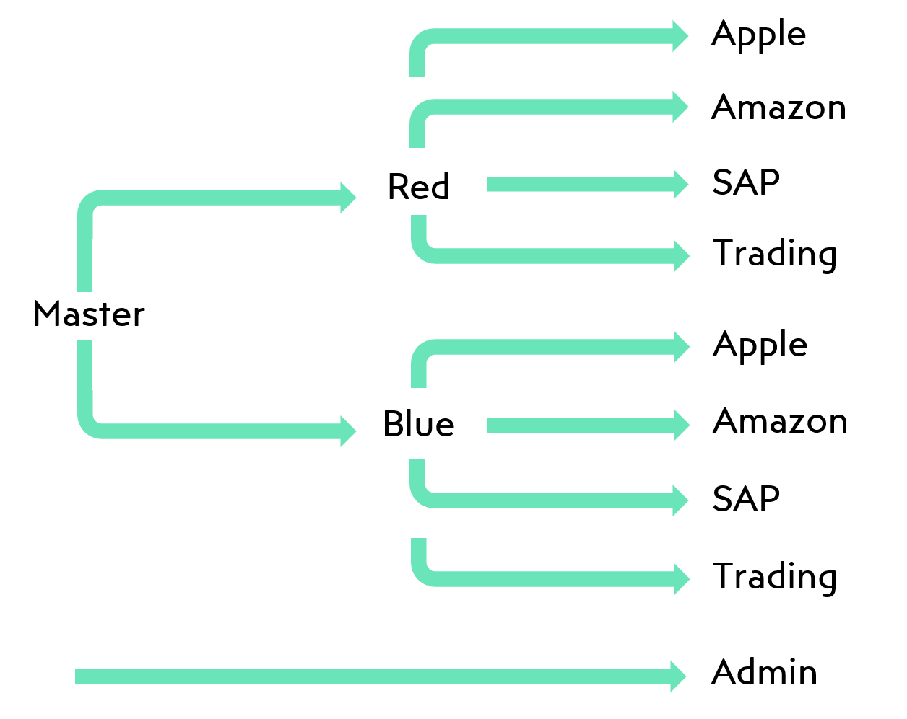
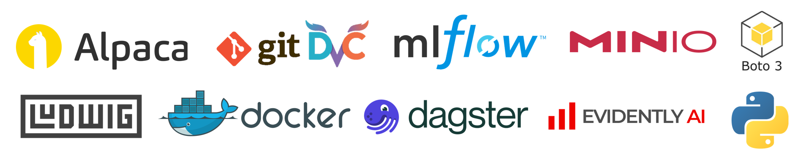

= MLOPS
:toc:

Repository for the MLOPS project @ Reutlingen University 

Students: Simon Jakschitz, Marcel Thomas, Alexander Wallner, Vincent Mattes, Kristian Paulic and Glenn Verhaag

Professor: Christian Decker

== Repository structure 

=== Master branch 
* Default branch including pipeline code
* Used to develop new feature used by both teams
* Base for the red vs. blue competition branches 

=== Red/Blue branches
* One branch per team per stock 
* Includes pipeline code 
* Used by the teams to configure .yml config files for stock specific pipelines

=== Admin branch 
* Includes *additional scripts and further documentation* about the developement process

== Dependecies/Tools used
The following tools/libraries are used within the pipelines:

* *Model training and serving:* Ludwig
* *Tracking of experiments/model training:* mlflow tracking server
* *Storage of models, input data, predictions and reports:* Minio + Boto 3
* *Versioning of all artifacts:* Git + DVC
* *Papertrading:* Alpaca API + one Alpaca account per team
* *Build and deployment of pipelines:* Docker and Dagster
* *Monitoring and reporting:* evidently.ai

== Getting started
To start a pipeline without any prior runs (on first startup or after a crash and sytem reset), first deploy the follwing services:

[cols="1,1"]
|=================
|Service |Docker compose file 

|Minio Server
|docker-compose.yml

|Dagster Dagit, Dagster Daemon & Postgres DB
|my-dagster-project\docker-compose.yml

|MLFlow tracking Server
|mlflow-tracking-server\docker-compose.yml
|================= 

Make sure all secrets are setup correctly according to the <<secrets>> section.

As soon as all services are deployed, execute the pipeline steps in the following order:

1. Run **setupDVCandVersioningBucket** to initialize DVC and create the required S3 buckets.
2. Run **fetchStockDataFromSource** to pull the input data via the stock data API.
3. Run **trainLudwigModelRegression** to train a model.
4. Run the remaining pipeline steps (**ModelPhase** and **MonitoringPhase**) to create a prediction and a report (reports are only created after the second pipeline run).

== Secret handling [[secrets]]
To ensure secure operation of the pipelines and to avoid storing unencrypted secrets in the github repository, all secrets are stored in a local *.env.secrets* file.
The individual pipeline branches include a *.env.secrets.template* file. To run a pipeline, asign your secret values to the variables inside this file. Then remane the file to *.env.secrets* (delete the *.template* suffix).
The following secrets need to be set:

* TOKEN
* AWS_ACCESS_KEY_ID
* AWS_SECRET_ACCESS_KEY
* API_KEY 
* API_SECRET

== Components
=== MLFlow Trainer

The MLFlowTrainer class enables training, logging, and versioning of machine learning models based on Ludwig and MLflow. This class integrates functions for accessing data in S3 buckets, training models, and versioning with DVC (Data Version Control). It provides a structured framework for training and managing models, specifically for stock history-based data.

==== Main function

* *Initialization and Configuration*: Sets the S3 bucket URLs and ensures that AWS access keys and environment variables for connecting to AWS-S3 are properly configured.
* *Data Preparation*: Loads and filters data for training (up to 2023) and testing (from 2024 onward).
* *Model Training*: Trains a model based on a Ludwig configuration file and logs results and parameters with MLflow.
* *Versioning and Storage*: Versions the Ludwig configuration file and saves the trained model along with run metrics and artifacts to S3 and DVC.

==== Code-Overview

===== Constructor `__init__`

The constructor initializes the following key parameters::
* `model_name`, `data_name`, `ludwig_config_file_name`: Specifies the model, data, and Ludwig configuration path.
* `model_bucket_url`, `mlflow_bucket_url`, `data_bucket_url`: S3 bucket URLs for storing models, MLflow logs, and training data.
* AWS environment variables: Loads access keys and endpoint URLs for AWS-S3 from the environment variables.

===== Method `train_model`

The `train_model` method performs training and logging in several steps:

1. *Data Retrieval*: Loads CSV data from an S3 bucket and filters it by year (up to 2023 for training and from 2024 for testing).
2. *MLflow Run Initialization*: Starts an MLflow run and logs the run ID.
3. *Configuration Validation*: Checks if the Ludwig configuration file exists and loads its content.
4. *Model Training*: Trains a Ludwig model based on the 2023 data and logs parameters and metrics.
5. *Saving and Versioning*:
** Saves the trained model and artifacts locally, versions them with DVC, and uploads them to the corresponding S3 bucket.
** Updates the metadata of each run in a `meta.yaml` file, which is also versioned and saved.
6. *Model and Run Compression*: Compresses the MLflow run folder and uploads it to S3.
===== Additional methods

* `upload_directory_to_s3`: Uploads a local directory to the specified S3 bucket.
* `upload_meta_yaml_to_s3`: Updates and versions the `meta.yaml` file and uploads it to the S3 bucket.
* `extract_model_name`: Extracts the model name from the Ludwig configuration file.
* `save_model_to_s3`: Saves the trained model and experimental results in S3, compresses and versions the results.
* `log_params` and `log_metrics`: Logs the model parameters and metrics in MLflow for systematic traceability.

==== Requirements

* *Ludwig*: For training models based on YAML configuration files.
* *MLflow*: For logging model results and metrics.
* *DVC (Data Version Control)*: For versioning models and configuration files.
* *boto3*: For communication with AWS S3.
* *AWS S3*: For storing and loading training data and models.
* *AlphaVantage API* For extracting stock data.

=== Alpaca Trader

The `AlpacaTrader` class enables automating stock trading strategies based on predictions (regression or classification) via the Alpaca API. The class includes functions for retrieving account information, placing buy and sell orders, and analyzing potential gains and losses based on stock predictions.

==== Main function

* *Account Management*: Enables retrieval of account information such as available cash, buying power, and total value.
* *Prediction Integration*: Based on a model type (regression or classification), makes stock predictions and trading decisions.
* *Automated Trading Strategy*: Supports buying and selling stocks based on predicted gains and losses, taking a threshold into account.
* *Trade and Portfolio Management*: Calculates potential gains and losses and manages buy and sell decisions.

==== Code Overview

===== Constructor `__init__`

The constructor initializes the following parameters:
* `api_key`, `api_secret`, `base_url`: API keys and base URL for connecting to the Alpaca API.
* `threshold`: The threshold value for deciding on trading actions.
* `stocks`: A dictionary with stock symbols and their predictions.
* `context`: Context object for logging.
* `prediction_type`: Sets the type of prediction (`regression` or `classification`).

===== Method `get_account_info`

Retrieves current account information, including cash, buying power, and equity, and returns it as a dictionary.

===== Method `get_latest_close`

Fetches the latest available closing price for a specified stock and returns it. If the current closing price is unavailable, the previous day's price is used.

===== Method `get_prediction`

Retrieves the stored prediction for a specified stock and returns it.

===== Method `place_buy_order`

Places a buy order for a specified stock and returns the order information.

===== Method `place_sell_order`

Places a sell order for a specified stock and returns the order information.

===== Method `check_position`

Checks the number of shares held for a specified stock in the portfolio and returns the count.

===== Method `calculate_potential_gains_and_losses`

Calculates potential gains and losses for stocks held in the portfolio, based on predictions.

===== Method `determine_best_and_worst`

Determines the stock with the highest potential gain and the stock with the highest loss based on the calculated potential gains and losses.

===== Method `sell_worst_loss_stock`

Sells the stock in the portfolio with the highest loss, if it exists.

===== Method `sell_loss_stock`

Sells stocks in the portfolio for which predictions indicate losses.

===== Method `buy_best_gain_stock`

Buys the stock with the highest predicted gain and sells any existing positions with lower profit potential.

===== Method `execute_trade`

Executes the trading logic based on predictions. Depending on `prediction_type`, either regression or classification is used to guide decision-making.

==== Requirements

* *alpaca-trade-api*: For accessing the Alpaca trading platform.
* *time*: For pauses between transactions.
* *logging*: For logging trading actions and results.

=== CSVProcessor

The `CSVProcessor` class enables downloading and processing CSV files from an S3-compatible storage, extracting relevant information, and saving it in various formats. The class is useful for working with stock prediction data and storage.

==== Main function

* *File Download*: Downloads only files containing the team name from a specified S3 bucket.
* *Data Extraction and Processing*: Extracts the last row from the downloaded CSV files and creates a list of predictions.
* *Data Formatting*: Saves the processed data as CSV and JSON and creates a dictionary with stock predictions.
* *Cleanup*: Removes downloaded files or the entire directory.

==== Code Overview

===== Constructor `__init__`

Initializes the following parameters:
* `bucket_name`: Name of the S3 bucket from which files are downloaded.
* `local_download_path`: The local path to which files are downloaded.
* `stock_symbol_mapping`: A mapping dictionary to associate filenames with stock symbols.
* `team_name`: The team name to search for in filenames.

The constructor also creates the download folder if it does not exist and connects to the S3-compatible storage using the MinIO API.

=== Method `process_and_upload_symbol_data`

Download of stock-data from AplhaVantage API and data-preperation for model training
- use of technical indicators like (RSI, EMA, DMA etc.)
- creation of dataframe and new for use-case customized columns
- quality control
- storage of pandas dataframe in Minio S3 Bucket

===== Method `download_files`

Downloads files containing the team name from the S3 bucket and returns the paths of the downloaded files.

===== Method `extract_last_row`

Reads a CSV file, extracts the last row, and adds the stock symbol from `stock_symbol_mapping`. This method returns the extracted data as a list.

===== Method `get_stock_name_from_filename`

Extracts the stock name from the filename by splitting it using the underscore (`_`). This is used to correctly identify stock symbols.

===== Method `process_files`

Iterates through a list of downloaded files and extracts the last rows from each file. Returns the aggregated data and corresponding column names.

===== Method `save_to_csv`

Saves the processed data to a CSV file. This method creates a new file and adds the column names and row content.

===== Method `create_stocks_dict`

Creates a dictionary in which stock symbols are keys and their final prediction as values. This dictionary can be used for further analysis or storage.

===== Method `save_stocks_to_json`

Saves the stock prediction dictionary to a JSON file, offering an easy way to store predictions for use in other applications.

===== Method `cleanup_files`

Deletes a list of files from the local system if they exist.

===== Method `cleanup_directory`

Deletes all files in `local_download_path` and removes the directory. This is useful for cleaning the workspace after processing is complete.

==== Requirements

* *boto3*: For connecting to an S3-compatible storage.
* *pandas*: For data processing and extraction from CSV files.
* *csv*, *json*: For working with CSV and JSON files.
* *os*: For handling file paths and directories.

=== Serving

The task of the Serving Component is to make the trained models available via a web-API. 

Therefore, a pipelinestep called "serve_job" was created. Here, the in the .env file configured model gets pulled from the minio service and gets served via docker command and made available through the port configured in the .env file.
Since it was targeted by the team to serve the model via Docker, a workaround was necessary, since this means that a Docker container (the pipeline) has to start another container (the model). The workaround was to add a Docker binary (comparable to a .exe file in windows) into the pipeline container and mount the Docker.sock into it. Thus, the pipeline gains access to the Docker environment from the underlying system (the provided virtual machine) and can manage images and containers.

=== Monitoring
To track the performance of deployed models, we decided to integrate a basic monitoring setup into our pipelines. We use the tool *evidently.ai* as a plug-and-play solution to create reports based on our models predictions. The report is updated everytime the pipeline code is executed/a new prediction is made. This approach allows us to montitor prediction performance based on metrics like the Mean Absolute Error (MAE), Mean Squared Error (MSE) or even more advanced metrics like target- and data drift. These metrics could be used to automatically trigger a re-training of the model once a certain performance threshold is reached. We decided, however, to keep a human in the loop and only trigger re-training manually as needed. This approach fits our solutions monitoring needs, without creating additional complexity.

The monitoring consists of the following steps:

1. Pull the predictions from the S3 bucket.
2. Filter the data and shift the prediction by one day, so it can be compared to the following days ground truth.
3. Create performance report for timeframe up until the previous day. 
4. Save and upload the report to S3 in .html format.
5. Add and push the report to DVC to version it.

Reports are created as an evidently.ai Report object. The report can be customized by providing presets to the constructor:
[source,python]
----
report = Report(metrics=[
            DataDriftPreset(), 
            TargetDriftPreset(),
            DataQualityPreset(),
            RegressionPreset()
        ])
----
Here we are using presets to include relevant performance metrics and various drift-detection indicators in our report.

 

== Additional systems

=== MLflow Tracking Server

This script downloads experimental run data from MLflow from an S3-compatible storage (MinIO), extracts any ZIP files if necessary, and updates `meta.yaml` files to set local `artifact_uri` path references.

==== Project Overview

The script is part of a project that automates the downloading of MLflow runs and prepares them for local processing. In addition to this script, the project includes `Dockerfile`, `docker-compose.yml`, `cron.sh`, `mlflow.sh`, and `requirements.txt`, all of which contribute to configuring and managing the project.

==== Requirements

The following packages and dependencies are needed:
* *boto3*: For connecting to S3-compatible storage.
* *PyYAML*: For editing the `meta.yaml` files.
* *logging*: For console- and file-based logging.

Install the required dependencies with `requirements.txt`:

[source,shell]
----
pip install -r requirements.txt
----

==== Functionality

The script consists mainly of a function `download_mlflow_runs`, which performs all necessary steps to download and process MLflow data.

===== `download_mlflow_runs`

[source,python]
----
def download_mlflow_runs(mlflow_bucket_name, modelconfigs_bucket_name, local_directory, s3_client):
    ...
----

This function performs the following steps:

1. **Download MLflow Runs**: Downloads all files in the specified MLflow bucket (`mlflow_bucket_name`).
2. **Extract and Adjust `meta.yaml`**: If a downloaded file is a ZIP file, it extracts it, and the contained `meta.yaml` is adjusted to set `artifact_uri` to a local path.
3. **Download `meta.yaml` from the `modelconfigs` Bucket**: The script downloads an additional `meta.yaml` file from another S3 bucket (`modelconfigs_bucket_name`).

===== Logging

Logging is done both on the console and in a log file (`cron.log`). Log entries include:
* Successful downloads of files
* Extraction and adjustment of `meta.yaml` files
* Completion reports for the entire process

==== File Overview

===== Dockerfile

The Dockerfile sets up the environment to run the script in a container. It ensures all dependencies are installed and environment variables are correctly set before running the script.

===== docker-compose.yml

This file defines services required for running the script, including all dependent containers, such as MinIO (S3-compatible storage).

===== cron.sh

A shell script that configures the `cron` service and executes the `mlflow.sh` script at scheduled times to initiate the regular downloading of MLflow runs.

===== mlflow.sh

The main script that initiates the `download_mlflow_runs` process. It can be scheduled by the `cron.sh` script to automate periodic downloads.

===== requirements.txt

Lists the Python libraries and versions required for the project, ensuring a consistent environment.

== Additional documentation
For further information on the development process, see the https://github.com/PriXss/MLOPS/tree/admin[admin branch].

It includes:

* Additional scripts
* Slide deck used for the final project presentation
* Report about implementation decisions, challenges and lessons learned
