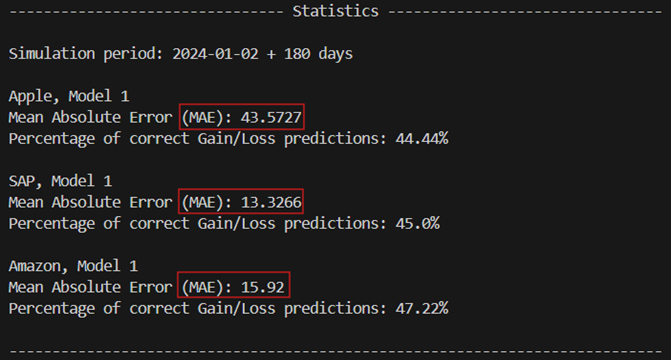

# MLOPS - Admin branch - scripts

## Contents

### competition-simulation.py
- Python script used to simulate red vs. blue competition
- The script runs a simulation for a pre-defined time period
- One or multiple models per stock can be tested at the same time
- Is used to test Mean Absolute Error (MAE) and percentage of correct/incorrect sentiment in predictions

### trading-monitoring.py
- Python script used to test the connection to our Alpaca (paper-)trading account
- Connects to Alpaca account, checks the current account balance and stock holdings, and lists current trading activities

## Usage

To use the scripts, open the '.env.template' file and fill in all the required secrets. 
Then remove the '.template' suffix from the file name and run the scripts via your IDE or command line. 